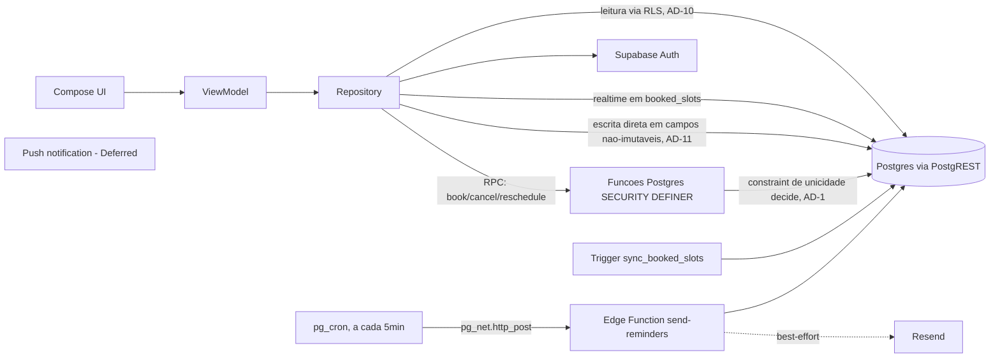
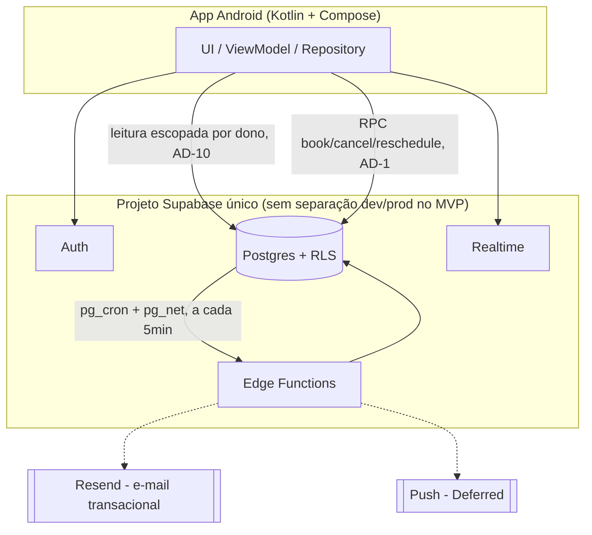
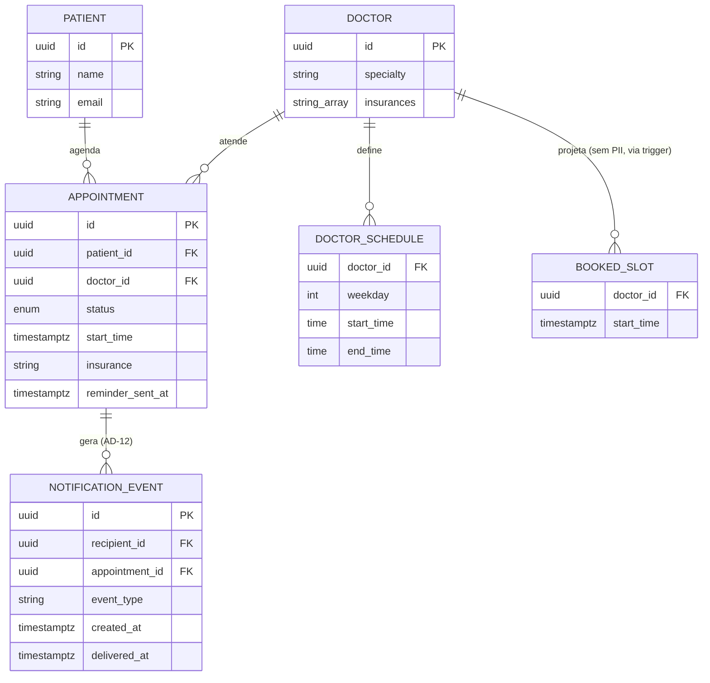

# Architecture Spine — Agenda Médica

> **Revisão 2026-09-17:** backend trocado de Firebase para **Supabase**, por decisão do usuário — evita a exigência de cartão de crédito do Firebase (Cloud Functions só roda no plano Blaze). Supabase não exige cartão em nenhuma camada do free tier. Decisão de **push notification foi deliberadamente deferida** (ver Deferred) para ser resolvida como seu próprio épico, não bloqueia o restante.

## Design Paradigm

**Mobile:** MVVM com fluxo de dados unidirecional — `View (Compose)` observa `ViewModel` (`StateFlow`/`UiState`), `ViewModel` chama `Repository`, `Repository` é a única camada que fala com Supabase (`supabase-kt`: `auth-kt`, `postgrest-kt`, `realtime-kt`, `functions-kt`). Nenhuma camada de UI acessa Supabase diretamente.

**Backend:** **Postgres-nativo server-authoritative**: o banco relacional é a fonte de dados e a própria estrutura do schema (constraint de unicidade, triggers) garante a regra central do produto — não apenas o código de aplicação. Mutação de estado sensível (agendar, cancelar, reagendar) passa por funções Postgres (`SECURITY DEFINER`, chamadas via `.rpc()`), nunca por escrita direta de tabela. Leitura é direta via Row Level Security (RLS), sempre escopada por dono.

## Invariants & Rules

### AD-1 — Escrita de Consulta é sempre via função Postgres; a constraint de unicidade é a garantia final [ADOPTED]

- **Binds:** FR-6, FR-7, FR-8, FR-9 (todo o ciclo de vida de uma Consulta)
- **Prevents:** dois clientes inserindo Consultas conflitantes diretamente via API do Supabase (PostgREST) sem passar pelo mesmo portão de controle de concorrência; e um Paciente agendando/cancelando em nome de outro (IDOR) explorando o fato de `SECURITY DEFINER` rodar com privilégio elevado, ignorando RLS nas tabelas que toca.
- **Rule:** RLS nega `INSERT`/`UPDATE`/`DELETE` de clientes autenticados na tabela `appointments`. A única via é chamar as funções Postgres `book_appointment`, `cancel_appointment`, `reschedule_appointment` (todas `SECURITY DEFINER`, expostas via `.rpc()`). Nenhuma dessas funções aceita `patient_id`/`doctor_id` como parâmetro do chamador para fins de identidade — cada uma lê `auth.uid()` internamente (via `auth.uid()` do contexto da sessão) para saber quem é o Paciente/Médico da operação; um parâmetro de outro usuário na chamada é ignorado ou rejeitado, nunca confiado. Toda função `SECURITY DEFINER` deste projeto fixa `SET search_path = public, pg_temp` na sua definição — sem isso, a função fica vulnerável a *search_path hijacking* (um objeto malicioso em outro schema do path sendo resolvido no lugar do pretendido), risco padrão de `SECURITY DEFINER` no Postgres. A garantia final de concorrência não é a lógica da função, é o próprio schema: um **índice único parcial** `UNIQUE (doctor_id, start_time) WHERE status = 'confirmed'` faz um agendamento duplicado ser uma violação de constraint do banco — mesmo um bug na função não consegue produzir duas Consultas confirmadas para o mesmo médico/horário. A função captura a violação (`unique_violation`, SQLSTATE `23505`) e a relança como um erro `CONFLICT` (ver AD-9).

### AD-2 — MVVM com camada de dados única [ADOPTED]

- **Binds:** todo o app Android
- **Prevents:** telas ou ViewModels chamando `supabase-kt` diretamente, criando múltiplos pontos de acesso divergentes aos mesmos dados.
- **Rule:** toda Composable lê estado de um `ViewModel`; todo `ViewModel` fala só com um `Repository` (nunca com o cliente Supabase diretamente); todo acesso a Supabase vive na camada `data/`.

### AD-3 — Consulta usa status, nunca é apagada

- **Binds:** FR-8, FR-9, tabela `appointments`
- **Prevents:** perda de histórico ao cancelar (quebraria "Minhas Consultas" mostrando o passado, e qualquer auditoria futura).
- **Rule:** `status` é um `ENUM` Postgres com exatamente dois valores: `confirmed` e `cancelled`. Cancelar grava `status = 'cancelled'` (nunca um `DELETE`). Toda leitura de "horários ocupados" e "minhas consultas ativas" filtra por `status = 'confirmed'`.

### AD-4 — Horários disponíveis são computados, nunca armazenados como slots

- **Binds:** FR-5, FR-6
- **Prevents:** uma linha de "slot" por intervalo de 15 min por médico por dia — volume desnecessário e um segundo lugar para o estado de ocupação divergir da Consulta real.
- **Rule:** a agenda semanal do Médico vive em `doctor_schedules (doctor_id, weekday, start_time, end_time)` — tabela normalizada, não um JSON solto. A grade de horários de um dia é sempre derivada em memória no app: `doctor_schedules` menos os horários já ocupados (`booked_slots`, ver AD-10 — nunca lida diretamente da tabela `appointments` de outros usuários). `start_time`/`end_time` são interpretados no fuso fixo `America/Sao_Paulo` (app de escopo Brasil, sem suporte a múltiplos fusos — PRD, RNFs Transversais); como `appointments.start_time` é `timestamptz` (Postgres armazena o instante absoluto, timezone-aware nativamente), toda comparação de antecedência mínima (RF-6) e janela de cancelamento (RF-8/RF-9) é sempre "instante vs. instante", nunca horário local textual.

### AD-5 — Lembrete de 24h é disparado pelo próprio Supabase (pg_cron), nunca pelo cliente

- **Binds:** FR-10
- **Prevents:** depender do app do Paciente estar aberto/rodando no momento exato do lembrete; e duas execuções sobrepostas notificando a mesma Consulta duas vezes.
- **Rule:** `pg_cron` está disponível em todos os planos do Supabase, incluindo o gratuito (confirmado — não é feature Pro-only). Um job `pg_cron` roda a cada 5 minutos e chama `net.http_post` (extensão `pg_net`) para invocar a Edge Function `send-reminders` — tudo dentro do próprio projeto Supabase, sem depender de um agendador externo. A Edge Function usa a **`service_role` key** (não a `anon` key) para ler `appointments` de todos os pacientes ignorando RLS — é a única peça do sistema autorizada a fazer isso, e essa chave nunca é exposta ao app Android nem versionada em texto puro (fica só nos *secrets* do projeto Supabase, injetada via variável de ambiente na Function). A Function busca `appointments` com `status = 'confirmed'`, `reminder_sent_at IS NULL`, cujo `start_time` caia em `(now(), now() + 24h]`, e **reivindica** todas as linhas devidas numa única instrução (`UPDATE ... WHERE id IN (SELECT ... FOR UPDATE SKIP LOCKED) RETURNING ...`, com limite por execução) antes de enviar — isso é o que impede duplicidade sob execuções sobrepostas. **Desvio consciente (Story 3.1):** em vez da janela fixa `[24h, 24h5min)` original, o lembrete é por "vencimento" — um job atrasado ou um envio que falhou é retomado nas execuções seguintes até o horário da consulta, e a reivindicação em lote (`SKIP LOCKED`) mantém a mesma garantia de um e-mail por consulta. Envia e-mail via Resend (best-effort). Push **não está resolvido** (ver Deferred) — a Function não falha por causa disso, só não envia esse canal ainda.

### AD-6 — Papel da conta é fixo e verificado ao vivo pelo RLS, nunca por um claim em cache

- **Binds:** FR-1, FR-2, FR-3 (identidade de Paciente vs Médico)
- **Prevents:** um cliente se autodeclarando "médico" no cadastro; e o problema (comum em outras plataformas) de um papel ficar "preso" num token JWT em cache depois de mudar no banco.
- **Rule:** `profiles (id uuid references auth.users primary key, role text check (role in ('patient','doctor')))`. O papel nunca vem de um campo que o cliente escolhe livremente: existem duas Edge Functions de cadastro distintas, `register-patient` e `register-doctor` — cada uma cria o usuário (Auth Admin API) e, **numa única transação** (via uma função Postgres `complete_registration(role, ...)` chamada pela Edge Function), insere a linha de `profiles` com o `role` fixo correspondente ao endpoint chamado (nunca lido do payload) **e** a linha correspondente em `patients` ou `doctors` — nunca as duas inserções soltas em passos separados. Se `complete_registration` falhar, a Edge Function desfaz o usuário recém-criado no Auth (compensação) antes de retornar erro — nunca fica um usuário de Auth "órfão" sem `profiles`. Toda RLS que depende do papel usa uma função auxiliar `is_doctor(uid)` / `is_patient(uid)` (`SECURITY DEFINER`, `STABLE`, `SET search_path = public, pg_temp`) que vive num schema não exposto pela API (ex.: `private`, nunca em `public`) que consulta `profiles` **a cada avaliação de política**, não um claim embutido no JWT — então uma mudança de papel (não há no MVP, mas a garantia vale) reflete imediatamente, sem problema de cache de token. Estar num schema não-exposto pela API **não basta** para ser chamável pelas políticas de RLS: a função precisa de `GRANT EXECUTE ... TO authenticated`, e toda política de RLS chama essas funções **sempre qualificadas pelo schema** (`private.is_doctor(auth.uid())`), nunca pelo nome solto — evita que o `search_path` da role `authenticated` decida qual função é resolvida.

### AD-7 — Convenção de nomes: código em inglês (snake_case), conteúdo em português

- **Binds:** todo o schema Postgres, toda Edge Function
- **Prevents:** um desenvolvedor futuro (ou o próprio Mauricio, meses depois) misturando `especialidade`/`specialty` como colunas diferentes para o mesmo dado.
- **Rule:** nomes de tabela, coluna, função e Edge Function em inglês, `snake_case` (convenção Postgres/Supabase): `patients`, `doctors`, `appointments`, `specialty`, `insurances`, `status`. **Valores** de enum voltados ao usuário (Especialidade, Convênio) permanecem em português, idênticos ao Glossário do PRD (`"Cardiologia"`, `"Unimed"`, ...) — são conteúdo exibido, não identificadores de código.

### AD-8 — Datas/horas são `timestamptz`, nunca texto

- **Binds:** `appointments.start_time`, qualquer coluna de data/hora
- **Prevents:** comparação de string quebrando a ordenação/janela de 24h e 48h.
- **Rule:** todo campo de data/hora de Consulta é `timestamptz` nativo do Postgres (instante absoluto, internamente UTC). Cálculo de antecedência mínima (RF-6) e janela de cancelamento (RF-8/RF-9) sempre compara `timestamptz`, nunca string formatada.

### AD-9 — Erros das funções Postgres seguem um vocabulário único

- **Binds:** `book_appointment`, `cancel_appointment`, `reschedule_appointment`, e qualquer função `SECURITY DEFINER` futura
- **Prevents:** cada função inventando seu próprio formato de erro, forçando o app a tratar cada chamada de um jeito.
- **Rule:** toda falha de negócio usa `RAISE EXCEPTION` com a mensagem prefixada por um código fixo e dois-pontos: `CONFLICT: ...` (conflito de horário, fora da janela de cancelamento, fora da antecedência mínima — inclui a violação de unicidade capturada pelo AD-1), `INVALID: ...` (parâmetro inválido), `FORBIDDEN: ...` (papel incompatível com a ação). A camada `Repository` do app faz o parse do prefixo antes dos dois-pontos para decidir a UI, de forma genérica para as três famílias. **Qualquer erro que não chegue nesse formato** (falha de rede, erro do PostgREST não originado de um `RAISE EXCEPTION` da função, timeout) cai num quarto bucket implícito, `UNEXPECTED` — tratado pela `Repository` com uma mensagem genérica de "tente novamente", nunca exibindo o texto bruto do erro de infraestrutura ao usuário nem confundindo-o com um erro de negócio.

### AD-10 — Leitura é sempre escopada por dono; disponibilidade nunca expõe dados de outro Paciente

- **Binds:** FR-4, FR-5, FR-6, RNF de proteção de dados do PRD
- **Prevents:** a busca por horários livres (AD-4) vazando `patient_id`/Convênio/nome de outros pacientes.
- **Rule:** RLS em `appointments`: um Paciente só enxerga linhas onde `patient_id = auth.uid()`; um Médico só onde `doctor_id = auth.uid()`. Para disponibilidade, existe `booked_slots (doctor_id, start_time)` — sem nenhuma coluna de identidade de paciente — mantida **por um trigger** (`AFTER INSERT OR UPDATE OF status, start_time ON appointments`, função `sync_booked_slots()`), não por cada função lembrar de escrever nela: isso fecha a divergência de uma futura função de escrita esquecer de manter a projeção sincronizada. O gatilho reage a `start_time` **e** `status` propositalmente — um `reschedule_appointment` que só muda `start_time` (sem tocar `status`) precisa disparar a sincronização tanto quanto um cancelamento; a função `sync_booked_slots()` remove a projeção do horário antigo e insere a do novo horário na mesma execução. RLS em `booked_slots` permite `SELECT` a qualquer usuário autenticado (não há PII para proteger ali). O app assina essa tabela via Supabase Realtime (`realtime-kt`, canal filtrado por `doctor_id=eq.<id>`) para refletir conflitos de outros usuários enquanto a tela de Detalhe está aberta — é *push* nativo (replicação lógica do Postgres), não polling.

### AD-11 — Perfil de Médico: campos imutáveis via trigger, o resto o dono edita direto

- **Binds:** RF-2 (Definição de perfil profissional do médico)
- **Prevents:** um contribuinte tratando `specialty`/`insurances` como editáveis via `UPDATE` direto do cliente (quebrando a regra de imutabilidade do PRD).
- **Rule:** `doctors (id uuid references profiles primary key, specialty text, insurances text[])` é atualizável diretamente pelo dono via RLS (`USING (id = auth.uid())`) — mas um trigger `BEFORE UPDATE`, função `enforce_doctor_immutable_fields()`, recusa a escrita se `specialty` ou `insurances` mudarem em relação ao valor já salvo (`OLD` vs `NEW`). A criação inicial desses dois campos acontece só na Edge Function de cadastro (AD-6). `doctor_schedules` (dias/horários, AD-4) não tem essa trigger — é livremente editável pelo dono, conforme RF-2.

### AD-12 — Eventos de notificação ficam num outbox simples, pronto para um consumidor de push futuro

- **Binds:** FR10 (notificações de evento — nova consulta, cancelamento/reagendamento)
- **Prevents:** o Story que implementa o registro de eventos (hoje) e o futuro job de push (quando essa decisão for tomada) inventando formatos incompatíveis para a mesma informação — um grava um formato, o outro espera outro.
- **Rule:** tabela `notification_events (id uuid PK default gen_random_uuid(), recipient_id uuid references profiles(id), event_type text check (event_type in ('new_appointment','cancellation','reschedule')), appointment_id uuid references appointments(id), created_at timestamptz default now(), delivered_at timestamptz)`. É escrita **pelas mesmas funções `SECURITY DEFINER`** de `book_appointment`/`cancel_appointment`/`reschedule_appointment` (AD-1), **na mesma transação** da mutação da Consulta — nunca por um processo separado que poderia perder o evento se falhar entre os dois passos. `delivered_at IS NULL` marca um evento ainda não entregue; um futuro consumidor de push filtra por isso e marca `delivered_at` ao entregar (mesmo padrão de "reivindicar antes de agir" do AD-5). RLS: nenhum cliente lê essa tabela diretamente — é infraestrutura interna, não uma superfície de API do app; só uma futura Edge Function de push (com `service_role`) a consome.

### Direção de dependência



## Consistency Conventions

| Concern | Convention |
| --- | --- |
| Naming (entities, files, interfaces, events) | Tabelas/colunas/funções/Edge Functions em inglês, `snake_case` (AD-7); pacotes Android por camada: `ui`, `viewmodel`, `data.repository`, `data.remote`, `domain.model`. |
| Data & formats (ids, dates, error shapes, envelopes) | IDs: `profiles.id`/`patients.id`/`doctors.id` = `auth.uid()` (chave primária = UUID do Supabase Auth, não um serial separado) — é o que as RLS de AD-10/AD-11 comparam. `appointments.id` é `uuid` gerado (`gen_random_uuid()`), sem chave natural. Datas: `timestamptz` (AD-8). Erros: prefixo fixo por causa, ver AD-9. |
| State & cross-cutting (mutation, errors, logging, config, auth) | Mutação de Consulta só via função Postgres (AD-1). Papel de conta via `profiles` + RLS ao vivo (AD-6). Sem tabela de configuração dinâmica no MVP — Especialidades/Convênios são uma constante versionada no código (app e Edge Functions), não uma tabela editável. |

## Stack

| Name | Version |
| --- | --- |
| Kotlin | 2.4.20 |
| Jetpack Compose (BOM) | 2026.08.00 |
| Compose Compiler Gradle plugin | 2.4.20 (deve ser sempre igual à versão do Kotlin) |
| supabase-kt (`auth-kt`, `postgrest-kt`, `realtime-kt`, `functions-kt`) | comunidade, referenciada na doc oficial do Supabase; conferir a versão 3.x mais recente no momento do build. `minSdk` 26 |
| PostgreSQL | gerenciado pelo Supabase — verificar a versão do projeto na criação |
| Supabase Edge Functions | runtime Deno |
| Resend (e-mail transacional) | camada gratuita — 3.000 e-mails/mês |
| Extensões Postgres `pg_cron` + `pg_net` (agendador do lembrete, dentro do próprio Supabase) | disponível em todos os planos, incluindo o gratuito |

## Structural Seed





Árvore mínima:

```text
app/
  ui/            # Composables por tela (Login, Busca, Detalhe, MinhasConsultas, ...)
  viewmodel/     # Um ViewModel por tela/fluxo
  data/
    repository/  # Único ponto de acesso a Supabase (Auth, Postgrest, Realtime, Functions)
    remote/      # Wrappers finos do supabase-kt
  domain/
    model/       # Paciente, Médico, Consulta, Especialidade, Convênio (Glossário do PRD)
supabase/
  migrations/    # Schema versionado: tabelas, ENUM, indice unico parcial (AD-1),
                 # triggers (sync_booked_slots — AD-10; enforce_doctor_immutable_fields — AD-11),
                 # job pg_cron + pg_net chamando send-reminders (AD-5),
                 # tabela notification_events (AD-12)
  functions/
    register-patient/   # Edge Function (AD-6)
    register-doctor/    # Edge Function (AD-6)
    send-reminders/     # Edge Function (AD-5), usa a service_role key
```

## Capability → Architecture Map

| Capability / Área | Vive em | Governado por |
| --- | --- | --- |
| Autocadastro e perfil de Médico (RF-1, RF-2) | `supabase/functions/register-doctor`, tabelas `doctors` + `doctor_schedules` | AD-6, AD-7, AD-11 |
| Cadastro de Paciente (RF-3) | `supabase/functions/register-patient`, tabela `patients` | AD-6, AD-7 |
| Busca de Médicos (RF-4) | `app/data/repository` (leitura direta via RLS) | AD-10 |
| Horários disponíveis (RF-5) | `app/domain` (cálculo local a partir de `doctor_schedules` + `booked_slots`) | AD-4, AD-10 |
| Agendamento (RF-6, RF-7) | função Postgres `book_appointment` | AD-1, AD-4, AD-8, AD-9, AD-10 |
| Cancelamento/Reagendamento (RF-8, RF-9) | funções Postgres `cancel_appointment` / `reschedule_appointment` | AD-1, AD-3, AD-8, AD-9, AD-10 |
| Notificações (RF-10) | `supabase/functions/send-reminders` + job `pg_cron`/`pg_net` (migração SQL) + tabela `notification_events` | AD-5, AD-12 |
| Recuperação de senha (RF-11) | Supabase Auth (nativo) | — (funcionalidade pronta do Supabase Auth, sem função própria; expiração do link segue o padrão do provedor — ver Deferred) |

## Deferred

- **Provedor de push notification (RF-10):** deliberadamente em aberto — por decisão do usuário, vira sua própria decisão/épico no momento oportuno, não bloqueia o restante da arquitetura. Candidatos a avaliar então: Firebase Cloud Messaging isolado (plano gratuito Spark, sem precisar do resto do Firebase) ou um serviço como OneSignal (tem camada gratuita própria). Quando essa decisão for tomada, o consumidor de push só precisa ler `notification_events` (AD-12) — a parte de registrar o evento já está pronta.
- **Ambientes dev/produção:** um único projeto Supabase no MVP; separar em dois projetos fica para se/quando o projeto sair do estágio de portfólio.
- **CI/CD:** nenhum pipeline automatizado definido além do workflow de lembrete — deploy manual via Supabase CLI (`supabase db push`, `supabase functions deploy`) é aceitável no volume e estágio atuais.
- **Publicação na Play Store:** fora de escopo — instalação direta no dispositivo (Android Studio/USB ou APK assinado) é suficiente para os critérios de sucesso do PRD.
- **Testes automatizados (framework específico):** o PRD (MS-3) exige cobertura nas regras críticas, mas a ferramenta exata é decisão de implementação — o caminho natural é `supabase start` (stack local via Docker, oficial da Supabase CLI) para testar as funções Postgres e a constraint de unicidade sem tocar dados reais, mais JUnit/Espresso no app.
- **Expiração do link de recuperação de senha (RF-11):** segue o padrão do próprio Supabase Auth (configurável no dashboard, análogo ao Firebase) — não é código próprio, não precisa de uma AD.
- **Ícones/categorias de Especialidade e Convênio além dos nomes:** qualquer metadado visual é decisão de UX/Build, não estrutural.
