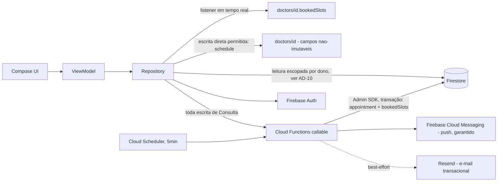
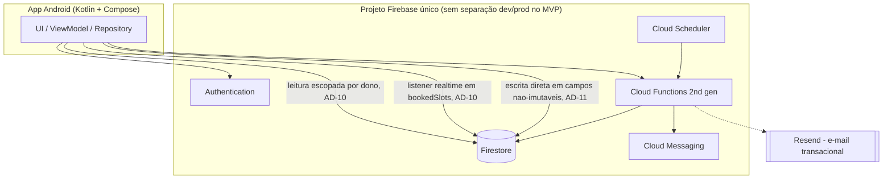
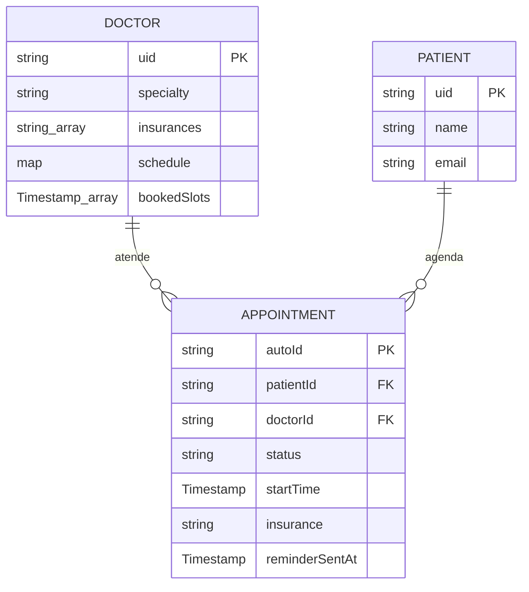

# Architecture Spine — Agenda Médica

## Design Paradigm

**Mobile:** MVVM com fluxo de dados unidirecional — `View (Compose)` observa `ViewModel` (`StateFlow`/`UiState`), `ViewModel` chama `Repository`, `Repository` é a única camada que fala com Firebase (Auth, Firestore, Functions). Nenhuma camada de UI acessa Firebase diretamente.

**Backend:** Serverless **server-authoritative para escrita**: o Firestore é a fonte de dados, mas toda mutação de estado sensível (agendar, cancelar, reagendar) é uma Cloud Function *callable* — nunca uma escrita direta do cliente. Leitura (busca, grade de horários, listas) é direta do app ao Firestore, mediada por security rules.

## Invariants & Rules

### AD-1 — Escrita de Consulta é sempre server-authoritative [ADOPTED]

- **Binds:** FR-6, FR-7, FR-8, FR-9 (todo o ciclo de vida de uma Consulta)
- **Prevents:** dois clientes escrevendo Consultas conflitantes diretamente no Firestore sem passar pelo mesmo portão de controle de concorrência — o cenário que quebraria a regra central do produto.
- **Rule:** o app Android **nunca** escreve no documento de uma Consulta — nenhum campo, incluindo flags de UI (ex.: um "confirmando cancelamento?" é estado local do Compose, nunca persistido no documento). Agendar, cancelar e reagendar são sempre uma chamada a uma Cloud Function *callable* (`bookAppointment`, `cancelAppointment`, `rescheduleAppointment`), que executa em uma transação atômica do Firestore cobrindo tanto o documento de `appointments` quanto a projeção `doctors/{id}.bookedSlots` (AD-10) — as duas escritas commitam juntas ou nenhuma commita. As Firestore Security Rules negam `create`/`update`/`delete` de clientes na coleção `appointments`; só o Admin SDK (rodando nas Functions) tem permissão de escrita ali. A mesma Function, após o commit, envia a notificação de evento (nova consulta / cancelamento) via FCM diretamente — não há uma segunda Function de trigger separada para isso (ver AD-5, que cobre só o lembrete agendado).

### AD-2 — MVVM com camada de dados única [ADOPTED]

- **Binds:** todo o app Android
- **Prevents:** telas ou ViewModels chamando Firebase diretamente, criando múltiplos pontos de acesso divergentes aos mesmos dados.
- **Rule:** toda Composable lê estado de um `ViewModel`; todo `ViewModel` fala só com um `Repository` (nunca com `FirebaseFirestore`/`FirebaseFunctions` diretamente); todo acesso a Firebase vive na camada `data/`.

### AD-3 — Consulta usa status, nunca é apagada

- **Binds:** FR-8, FR-9, coleção `appointments`
- **Prevents:** perda de histórico ao cancelar (quebraria "Minhas Consultas" mostrando o passado, e qualquer auditoria futura).
- **Rule:** cancelar uma Consulta grava `status: "cancelled"` (nunca um `delete()`) — os dois únicos valores válidos de `status` são exatamente `"confirmed"` e `"cancelled"` (grafia americana, pinada aqui como constante compartilhada entre app e Functions, mesmo padrão do AD-7 para Especialidade/Convênio). Toda leitura de "horários ocupados" e "minhas consultas ativas" filtra por `status: "confirmed"`.

### AD-4 — Horários disponíveis são computados, nunca armazenados

- **Binds:** FR-5, FR-6
- **Prevents:** um documento de "slot" por intervalo de 15 min por médico por dia — volume desnecessário e um segundo lugar para o estado de ocupação divergir do documento de Consulta real.
- **Rule:** a grade de horários de um Médico em um dia é sempre derivada em memória: `horário de atendimento do Médico (doctors/{id}.schedule)` menos os horários já ocupados (`doctors/{id}.bookedSlots`, ver AD-10 — nunca lida diretamente da coleção `appointments` de outros usuários). Nunca existe uma coleção `slots`. Os horários de `schedule` (ex.: `"08:00"`–`"12:00"`) são interpretados no fuso fixo `America/Sao_Paulo` (app de escopo Brasil, sem suporte a múltiplos fusos — ver PRD, RNFs Transversais) e convertidos para `Timestamp` (instante absoluto) antes de qualquer comparação com `now` — a antecedência mínima (RF-6) e a janela de cancelamento (RF-8/RF-9) são sempre "instante vs. instante", nunca comparação de horário local.

### AD-5 — Lembrete de 24h é disparado pelo servidor, nunca pelo cliente

- **Binds:** FR-10
- **Prevents:** depender do app do Paciente estar aberto/rodando no momento exato do lembrete — o que falharia na maioria das vezes; e duas execuções da rotina agendada notificando a mesma Consulta duas vezes (janelas de execução podem se sobrepor).
- **Rule:** uma Cloud Function agendada (`Cloud Scheduler` + *scheduled function*, executando a cada **5 minutos exatos**) varre `appointments` com `status: "confirmed"` e `reminderSentAt == null` cujo `startTime` caia dentro da janela `[24h, 24h5min)` à frente de `now`. Dois canais, ambos com provedor decidido: **push via Firebase Cloud Messaging** (garantido) e **e-mail via Resend** (best-effort — camada gratuita de 3.000 e-mails/mês, sem SLA formal). **SMS não faz parte do escopo** (removido — decisão do usuário em 2026-09-17, sem provedor gratuito de texto livre disponível). Falha no e-mail nunca bloqueia o push. Idempotência: a Function marca `reminderSentAt` **dentro da mesma leitura-e-escrita** (transação ou `update` condicional em `reminderSentAt == null`) antes de disparar a notificação, para que duas execuções sobrepostas nunca enviem duas vezes para a mesma Consulta.

### AD-6 — Papel da conta é fixo e verificado no servidor

- **Binds:** FR-1, FR-2, FR-3 (identidade de Paciente vs Médico)
- **Prevents:** um cliente alterando seu próprio papel (custom claim) ou se passando por outro papel numa chamada de Function.
- **Rule:** o papel (`patient` | `doctor`) é gravado como *custom claim* do Firebase Auth **no momento do cadastro**, definido só pela Cloud Function de cadastro (nunca pelo cliente). Toda Cloud Function e toda Security Rule que dependem do papel leem o *custom claim* do token verificado — nunca um campo que o cliente possa mandar no payload. Custom claims só aparecem num ID token já emitido após um refresh forçado: a Function de cadastro é a única responsável por, antes de retornar sucesso ao app, garantir que o cliente chame `getIdToken(true)` — o app nunca deve navegar para a tela pós-cadastro (Busca/Agenda) usando o token antigo.

### AD-7 — Convenção de nomes: código em inglês, conteúdo em português

- **Binds:** todo o schema Firestore, toda a API de Functions
- **Prevents:** um desenvolvedor futuro (ou o próprio Mauricio, meses depois) misturando `especialidade`/`specialty` como chaves diferentes para o mesmo campo.
- **Rule:** nomes de coleção, campo, função e evento em inglês (`patients`, `doctors`, `appointments`, `specialty`, `insurance`, `status`). **Valores** de enum voltados ao usuário (Especialidade, Convênio) permanecem em português, idênticos ao Glossário do PRD (`"Cardiologia"`, `"Unimed"`, ...) — são conteúdo exibido, não identificadores de código.

### AD-8 — Datas/horas são `Timestamp`, nunca string

- **Binds:** `appointments.startTime`, qualquer campo de data/hora
- **Prevents:** comparação de string quebrando a ordenação/janela de 24h e 48h (ex.: fuso horário embutido incorretamente, comparação lexicográfica em vez de temporal).
- **Rule:** todo campo de data/hora de Consulta é um Firestore `Timestamp` nativo. Cálculo de antecedência mínima (RF-6) e janela de cancelamento (RF-8/RF-9) sempre compara `Timestamp`, nunca string formatada.

### AD-9 — Erros de Cloud Function seguem um vocabulário único

- **Binds:** toda Cloud Function *callable*
- **Prevents:** cada Function inventando seu próprio formato de erro, forçando o app a tratar cada endpoint de um jeito.
- **Rule:** toda falha de negócio usa `functions.https.HttpsError` com um código fixo por causa: `failed-precondition` (conflito de slot, fora da janela de cancelamento, fora da antecedência mínima), `invalid-argument` (payload inválido), `permission-denied` (papel incompatível com a ação). O app trata esses três códigos de forma genérica na camada `Repository`.

### AD-10 — Leitura é sempre escopada por dono; disponibilidade nunca expõe dados de outro Paciente

- **Binds:** FR-4, FR-5, FR-6, RNF de proteção de dados do PRD
- **Prevents:** a busca por horários livres (AD-4) vazando `patientId`/Convênio/nome de outros pacientes — o app leria a coleção `appointments` inteira do médico só para saber quais 15 minutos estão ocupados.
- **Rule:** Firestore Security Rules permitem a um Paciente ler apenas `appointments` onde `resource.data.patientId == request.auth.uid`, e a um Médico apenas onde `resource.data.doctorId == request.auth.uid`. Para disponibilidade, a mesma Cloud Function que escreve/cancela uma Consulta (AD-1) mantém, na mesma transação, uma projeção sem PII em `doctors/{id}.bookedSlots` (array de `Timestamp`, só o horário — sem identidade do paciente). O app assina essa projeção com um listener em tempo real do Firestore (`addSnapshotListener` em `doctors/{id}`) para refletir conflitos de outros usuários enquanto a tela de Detalhe está aberta — resolve a decisão de "atualização em tempo real" que ficava aberta no `addendum.md` do PRD: é *push* nativo do SDK, não polling.

### AD-11 — Perfil de Médico: campos imutáveis são protegidos por regra, o resto o dono edita direto

- **Binds:** RF-2 (Definição de perfil profissional do médico)
- **Prevents:** um contribuinte tratando `specialty`/`insurances` como editáveis via escrita direta do cliente (quebrando a regra de imutabilidade do PRD), enquanto outro assume que toda edição de perfil precisa passar por Cloud Function como AD-1 exige para Consulta — os dois não podem estar certos ao mesmo tempo sem essa regra.
- **Rule:** `doctors/{uid}` **é** escrito diretamente pelo cliente dono (`request.auth.uid == doctorId`) para os campos `schedule` (dias/horários, editável livremente — RF-2) e dados de perfil não-imutáveis. Uma Firestore Security Rule fixa `specialty` e `insurances` como imutáveis após a criação (`request.resource.data.specialty == resource.data.specialty`, idem para `insurances`) — a criação inicial (que define esses dois campos) é feita pela Cloud Function de cadastro (AD-6), nunca por um `update` posterior do cliente.

### Direção de dependência



## Consistency Conventions

| Concern | Convention |
| --- | --- |
| Naming (entities, files, interfaces, events) | Coleções/campos/Functions em inglês (AD-7); pacotes Android por camada: `ui`, `viewmodel`, `data.repository`, `data.remote`, `domain.model`. |
| Data & formats (ids, dates, error shapes, envelopes) | IDs: `patients/{uid}` e `doctors/{uid}` são **chaveados pelo UID do Firebase Auth** (não autoId) — é o que as Security Rules de AD-10/AD-11 comparam contra `request.auth.uid`. `appointments/{autoId}` usa ID auto-gerado do Firestore (sem chave natural). Datas: `Timestamp` (AD-8). Erros: `HttpsError` com código fixo por causa (AD-9). |
| State & cross-cutting (mutation, errors, logging, config, auth) | Mutação de Consulta só via Cloud Function (AD-1). Papel de conta via custom claim (AD-6). Sem coleção de configuração dinâmica no MVP — Especialidades/Convênios são uma constante versionada no código de ambos (app e Functions), não um documento editável. |

## Stack

| Name | Version |
| --- | --- |
| Kotlin | 2.4.20 |
| Jetpack Compose (BOM) | 2026.08.00 |
| Compose Compiler Gradle plugin | 2.4.20 (deve sempre ser igual à versão do Kotlin — contrato do Kotlin 2.0+) |
| Firebase Android BoM | ~34.17.0+ (conferir a mais recente no momento do build — já havia indício de 34.18.0 em 2026-09) |
| Cloud Functions for Firebase | 2ª geração (renomeada "Cloud Run functions" pelo GCP, nome "Cloud Functions for Firebase" ainda válido na doc do Firebase), runtime Node.js 22 — confirmar status GA vs. Preview no momento do build, fontes divergem |
| Firebase Authentication | Email/senha |
| Cloud Firestore | — |
| Firebase Cloud Messaging | — |
| Resend (e-mail transacional) | camada gratuita — 3.000 e-mails/mês |

## Structural Seed





Árvore mínima (app):

```text
app/
  ui/            # Composables por tela (Login, Busca, Detalhe, MinhasConsultas, ...)
  viewmodel/     # Um ViewModel por tela/fluxo
  data/
    repository/  # Único ponto de acesso a Firebase (Auth, Firestore, Functions)
    remote/      # Wrappers finos do SDK do Firebase
  domain/
    model/       # Paciente, Médico, Consulta, Especialidade, Convênio (Glossário do PRD)
functions/
  src/
    booking/     # bookAppointment, cancelAppointment, rescheduleAppointment
                 # (AD-1: transação appointment+bookedSlots; AD-10; envia push de evento)
    auth/        # onCreateAccount (define custom claim + cria doctors/{uid}|patients/{uid} — AD-6, AD-11)
    notifications/ # scheduled function do lembrete de 24h (AD-5)
```

## Capability → Architecture Map

| Capability / Área | Vive em | Governado por |
| --- | --- | --- |
| Autocadastro e perfil de Médico (RF-1, RF-2) | `functions/src/auth`, `doctors/{uid}` | AD-6, AD-7, AD-11 |
| Cadastro de Paciente (RF-3) | `functions/src/auth`, `patients/{uid}` | AD-6, AD-7 |
| Busca de Médicos (RF-4) | `app/data/repository` (leitura direta) | AD-10 |
| Horários disponíveis (RF-5) | `app/domain` (cálculo local a partir de `bookedSlots`) | AD-4, AD-10 |
| Agendamento (RF-6, RF-7) | `functions/src/booking.bookAppointment` | AD-1, AD-4, AD-8, AD-9, AD-10 |
| Cancelamento/Reagendamento (RF-8, RF-9) | `functions/src/booking.{cancel,reschedule}Appointment` | AD-1, AD-3, AD-8, AD-9, AD-10 |
| Notificações (RF-10) | `functions/src/booking.*` (evento, dentro da transação) + `functions/src/notifications` (lembrete agendado) | AD-1, AD-5 |
| Recuperação de senha (RF-11) | Firebase Authentication (nativo) | — (funcionalidade pronta do Firebase Auth, sem Cloud Function própria; expiração do link usa o padrão do Firebase, 1h — ver Deferred) |

## Deferred

- ~~Provedor de SMS e de e-mail transacional~~ — **resolvido.** Push (FCM, garantido) + e-mail (Resend, camada gratuita, best-effort) — ver AD-5 e Stack. SMS foi removido do escopo do produto (decisão do usuário, 2026-09-17): nenhum provedor gratuito de SMS de texto livre foi encontrado, e não compensa o esforço para um MVP de portfólio.
- **Expiração do link de recuperação de senha (RF-11):** resolvido pelo padrão do próprio Firebase Authentication (link de ação por e-mail expira em 1h, configurável no console) — não é código próprio, então não precisa de uma AD; citado aqui só para fechar a pergunta que o PRD deixou em aberto.
- **Ambientes dev/produção:** um único projeto Firebase no MVP (decisão tomada); separar em dois projetos fica para se/quando o projeto sair do estágio de portfólio.
- **CI/CD:** nenhum pipeline automatizado definido — deploy manual via Firebase CLI é aceitável no volume e estágio atuais.
- **Publicação na Play Store:** fora de escopo — instalação direta no dispositivo (Android Studio/USB ou APK assinado) é suficiente para os critérios de sucesso do PRD.
- **Testes automatizados (framework específico):** o PRD (MS-3) exige cobertura nas regras críticas, mas a ferramenta exata (JUnit/Espresso no app; Firebase Local Emulator Suite para testar as Cloud Functions e a transação de conflito sem tocar dados reais) é decisão de implementação, não de arquitetura — recomenda-se o Emulator Suite por ser o caminho oficial do Firebase para testar Functions+Firestore juntos localmente.
- **Ícones/categorias de Especialidade e Convênio além dos nomes:** qualquer metadado visual (ícone, cor por especialidade) é decisão de UX/Build, não estrutural.
